# HRMS (Human Resource Management System)

HRMS is a web-based system for managing recruitment, candidates, tickets,
departments, roles, performance, and exits. It includes a React frontend, a
Node/Express backend, and a MySQL database.

## Step-by-step walkthrough

Save the screenshots under `hrms-main/` using the filenames shown below.

### 1) Sign in and select a role
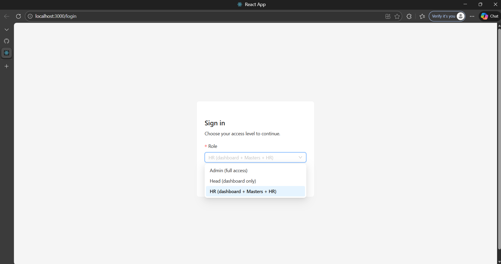

### 2) View the main dashboard (tickets)
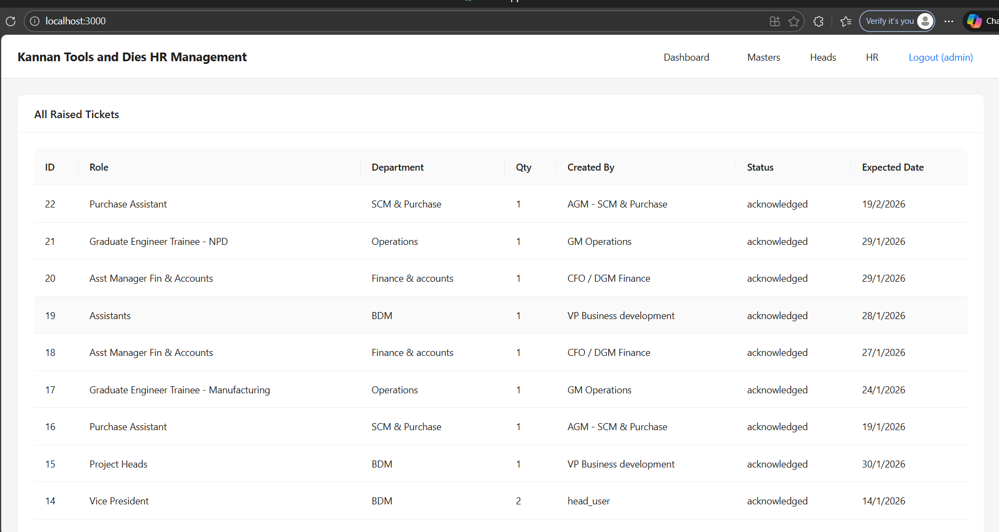

### 3) Manage departments (Masters)
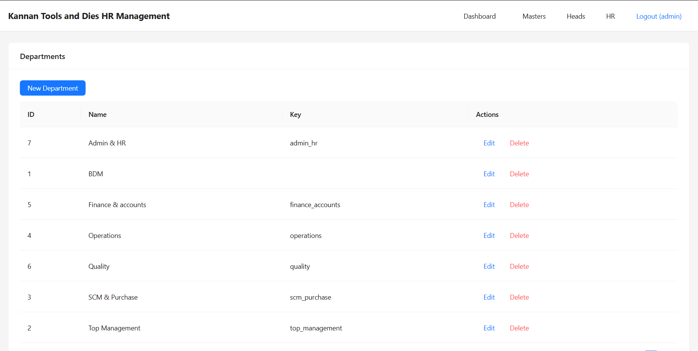

### 4) Manage roles (Masters)
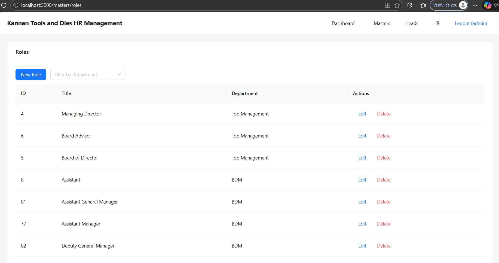

### 5) Manage employees (Masters)
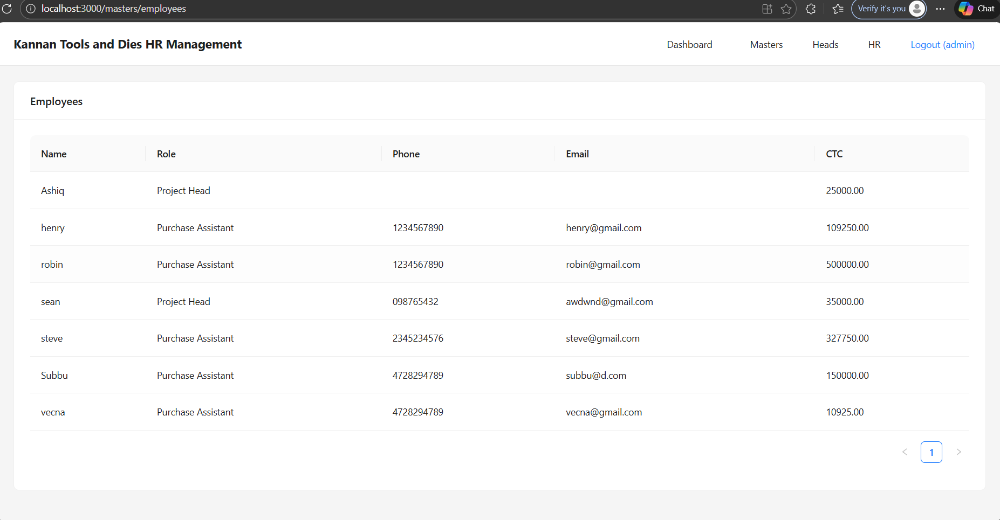

### 6) Raise a requirement (Heads)
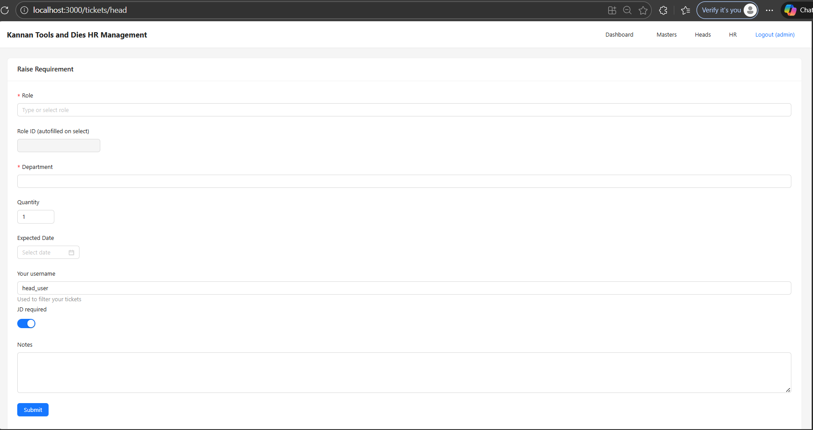

### 7) Select role for requirement
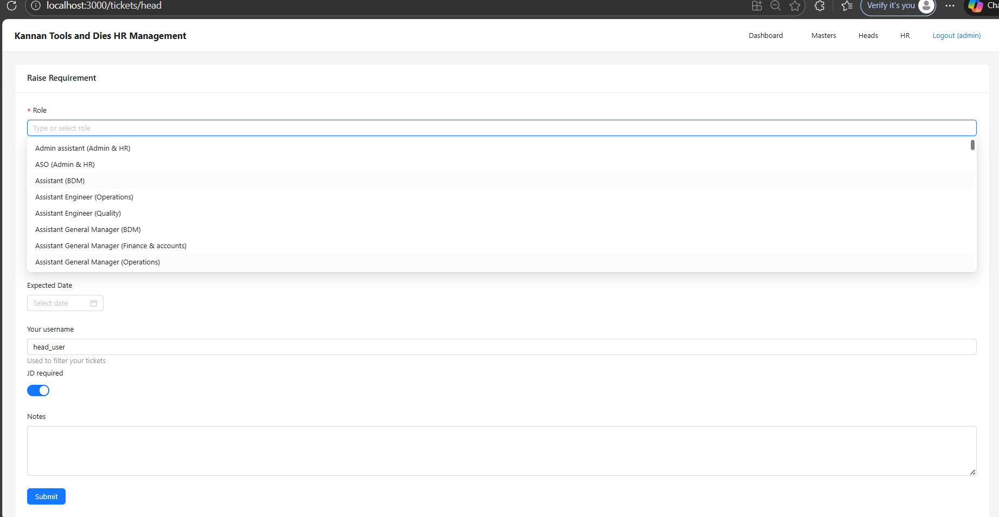

### 8) View my tickets (Heads)
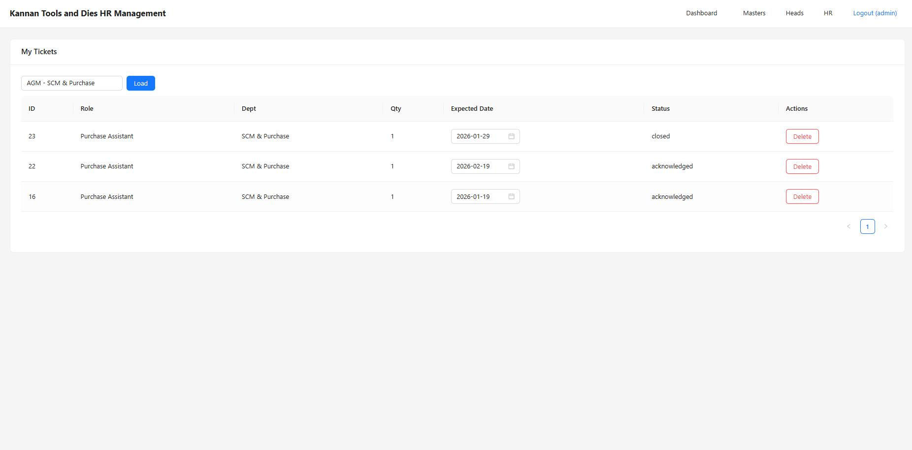

### 9) HR dashboard queue
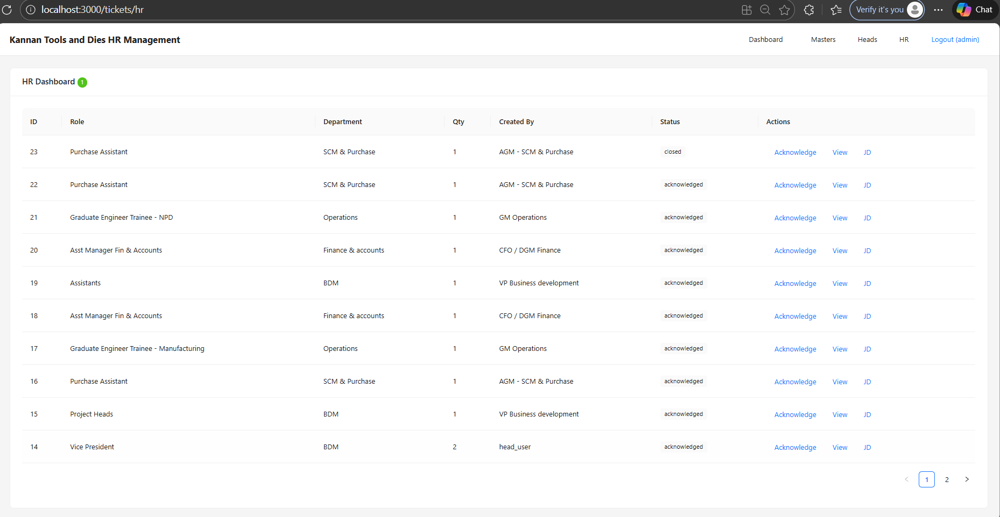

### 10) Candidate entry form (HR)
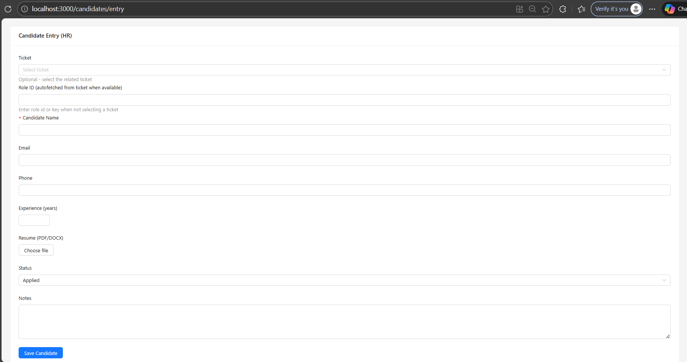

### 11) Shortlisted candidates (Heads)
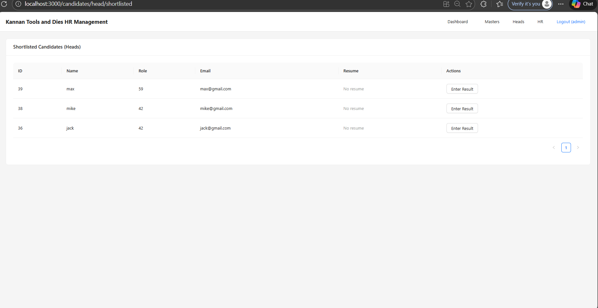

### 12) Enter interview result
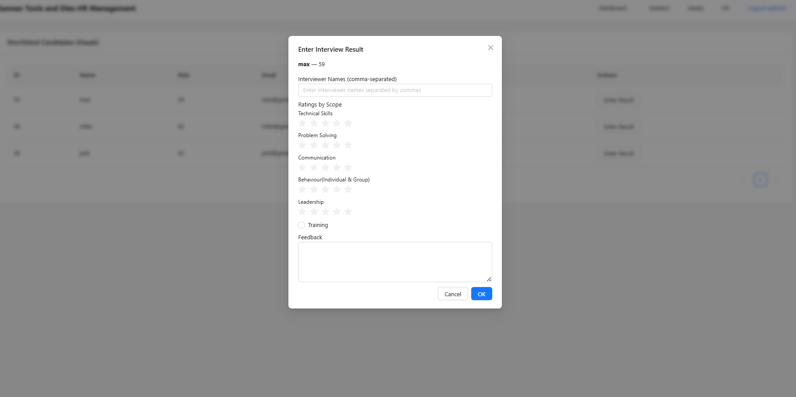

### 13) Candidate list and offer actions (HR)
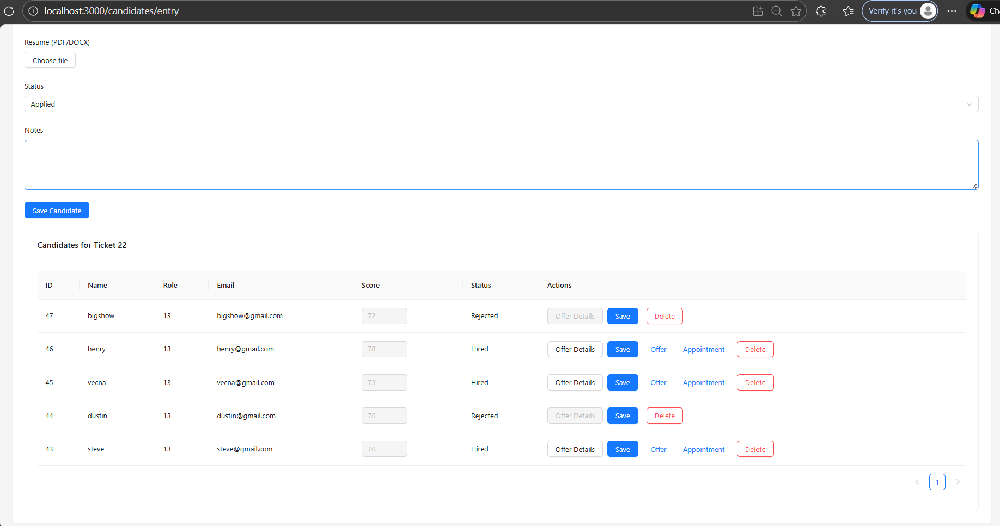

### 14) Training management (HR)
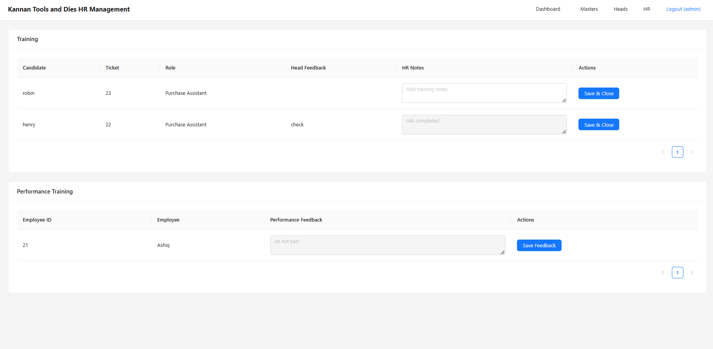

### 15) Performance scoring (Heads)
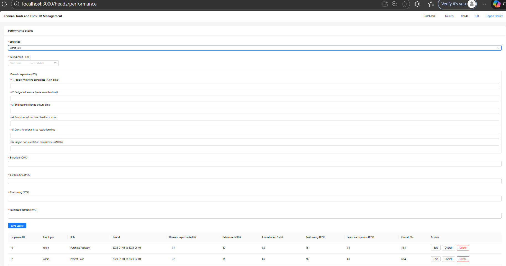

### 16) Performance actions (HR)
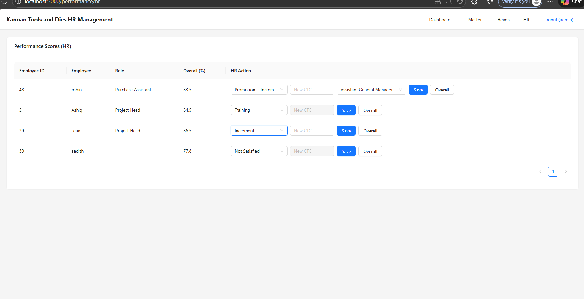

### 17) Overall performance history
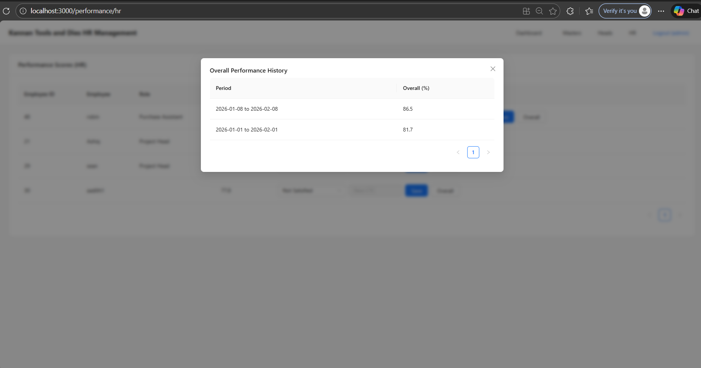

### 18) Exit Employees
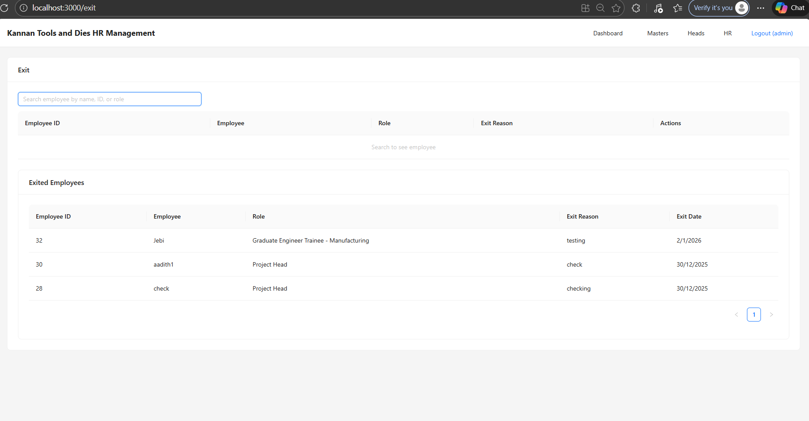

## Tech Stack

- Frontend: React, TypeScript, Ant Design, Axios
- Backend: Node.js, Express
- Database: MySQL
- PDF generation: Puppeteer, Mammoth

## Local Development

### Prerequisites

- Node.js 18+ and npm
- MySQL 8+

### 1) Database setup

Create a MySQL database and load the schema:

```bash
mysql -u root -p -e "CREATE DATABASE hrms_db;"
```

Then import the SQL files in `hr-backend/db/` or use the dump file
`Dump20251230 (1).zip` if it contains a full schema/data export.

### 2) Backend (API)

```bash
cd hr-backend
npm install

# Optional environment variables
export DB_HOST=127.0.0.1
export DB_USER=root
export DB_PASSWORD=root
export DB_NAME=hrms_db

node server.js
```

The backend runs on `http://localhost:5000`.

### 3) Frontend (Web)

```bash
cd frontend
npm install
npm start
```

Open `http://localhost:3000` in the browser. The frontend calls the API at
`http://localhost:5000/api` (see `frontend/src/services/api.ts`).

## Optional: Electron Build

```bash
cd electron
npm install
npm run start
```

Packaging is configured in `electron/scripts/prepare-build.js` and
`electron/package.json`.
